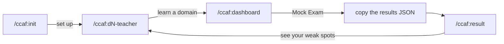

# CCAF Architect Exam Tutor

A Claude Code plugin that trains you for the **Claude Certified Architect, Foundations (CCAF)** exam.

Five domain tutors teach the material, then a configurable offline mock exam drills you on the traps.
Everything runs on your machine. Your progress lives in your home folder, never in the plugin, so a
plugin update can never wipe it.

The exam is scenario-based multiple choice: one right answer and three answers that look right. This
plugin is built around that single fact. It teaches you to name **why** each wrong answer is wrong,
which is the skill that carries to questions you have never seen.

## Quick start

```
/plugin marketplace add nortmas/ccaf
/plugin install ccaf@ccaf-marketplace
/ccaf:init
```

`/ccaf:init` creates your progress folder, shows you what is in the question bank, and tells you what
to do next. From there the loop is:



To update later: `/plugin marketplace update ccaf-marketplace`.

**You need:** Claude Code, `python3` (the app builder), and bash. The study app is one self-contained
HTML file, so any browser opens it offline.

## Commands

Every command is manual only. They never fire on their own and they add no ambient context, so they
cost you nothing until you type them.

| Command | What it does |
|---|---|
| `/ccaf:init` | Sets up your progress folder, then routes you to the right next step. |
| `/ccaf:d1-teacher` … `/ccaf:d5-teacher` | One interactive tutor per exam domain. |
| `/ccaf:dashboard` | Builds and opens your offline study app, and prints a short recap in chat. |
| `/ccaf:result` | Records a result. This is the only command that writes to your history. |

The five domains, with their weight on the real exam:

| | Domain | Weight | Bank |
|---|---|---|---|
| D1 | Agentic Architecture & Orchestration | 27% | 64 questions |
| D2 | Tool Design & MCP Integration | 18% | 47 |
| D3 | Claude Code Configuration & Workflows | 20% | 42 |
| D4 | Prompt Engineering & Structured Output | 20% | 41 |
| D5 | Context Management & Reliability | 15% | 46 |

## How the tutors teach

Each tutor walks its domain one task statement at a time, in a fixed loop: explain the concept, name
the tempting wrong move and the axis it fails on, apply it to a real production scenario, check that
you followed, then quiz you.

Three things make it stick:

- **No assumed vocabulary.** A tutor may not ask you to use a term it has not defined first, in plain
  words, with a small example.
- **Plain language.** Explanations are written so that a 12-year-old could follow any sentence that is
  not a technical term. Exam vocabulary stays exact and in English (`stop_reason`, `tool_choice`,
  *winning condition*), because you need to recognise the exam's own markers.
- **Real scenarios.** The exam frames every question inside one of six production cases (a support
  agent, code generation, multi-agent research, developer productivity, CI/CD, structured
  extraction). The tutors teach through those cases, not abstract examples.

Your tutor progress is saved as you go, so an interrupted session keeps what you covered.

## The 5 axes of failure

Every wrong answer is wrong for exactly one reason. Naming that reason is the transferable skill, so
the tutors drill it on every question and the dashboard tracks which one catches you most.

| # | Axis | The right answer wins because… |
|---|---|---|
| 1 | Determinism | It **guarantees** the result. The near-miss only **influences** it. |
| 2 | Exact hit | It names the **exact** tool, parameter or event. The near-miss picks the wrong member of the right family. |
| 3 | Right diagnosis | It fixes the **problem in the stem**. The near-miss fixes a different problem. |
| 4 | Proportionality | It **fits the size** of the task. The near-miss is too big or too small. |
| 5 | Root cause | It removes the **cause**. The near-miss covers a symptom. |

## The study app

`/ccaf:dashboard` rebuilds and opens a single offline HTML file with four surfaces.

**Dashboard.** A projected score against the 72% pass line, overall accuracy, how much of the bank
you have seen, and a "focus next" banner that names your weakest domain and starts a drill on it.
Below that: accuracy per domain against the exam's own weighting, your exam history with a score
trend, your tutor coverage, and the 5-axis tally of where you get caught.

**Mock Exam.** Pick a mode, narrow it to domains, choose a length, and sit it.

| Mode | Draws from |
|---|---|
| Weak areas | Your weak domains and the questions you got wrong. Long-unseen questions come back first. |
| Unseen | Questions you have never answered. |
| Random | The whole bank. |
| Review misses | Only questions you got wrong last time. |

One question per screen, like the real exam. Optional 2-minute-per-question limit that warns you at
zero but never submits for you, because this is practice. Pause and resume, or quit and carry on
later. Mark a question to come back to it, and a review screen lists anything blank or marked before
you submit. From the keyboard: `1`-`4` or `A`-`D` to answer, `J`/`K` or the arrows to move, `F` to
mark.

**Weak spots.** Built from the questions you actually got wrong. Each card gives the decision behind
the question, the rule that generalises, the words in the stem that gave it away, the right answer,
and why your instinct was tempting plus when it would have been correct. Filter by domain or axis.

**Cheatsheet.** A curated "what you see in the stem → the answer it points to" reference, 83 rows
across all five domains, with a search box.

After you submit, the results page opens on your misses only, with an axis badge on each one. Copy
the JSON and run `/ccaf:result` to record it.

## Your progress folder

Created on first run at **`~/.claude/ccaf-progress/`**. It is yours, it survives plugin updates and
uninstalls, and the plugin never overwrites what is already there.

| File | Holds |
|---|---|
| `profile.md` | Your recorded results and your ranked weak domains. |
| `stats.json` | Per-question and per-domain stats plus exam history. The authoritative record. |
| `fails-tracker.md` | The questions you missed, verbatim. |
| `trap-log.md` | Trap types by axis, with a running tally. |
| `cheatsheet.json` | The Weak spots cards, one per miss. |
| `learning-progress.json` | Which task statements each tutor has covered. |
| `ccaf-exam.html` | The generated study app. Rebuilt on every `/ccaf:init` and `/ccaf:dashboard`. |

If one of those files ever becomes unreadable, the plugin backs it up next to the original and tells
you. It never recreates a broken file from scratch, because that would throw away real history.

## How focus works

Nothing about anyone's weak spots is baked into this plugin. Focus is computed from your own data.

`/ccaf:result` is the only writer. Give it the app's results JSON, one sitting or several at once,
and it updates per-question stats, your fails and your Weak spots cards. Give it a screenshot or a
pasted breakdown from the official exam or another practice test, and it records a per-domain
snapshot instead. Either way it rewrites the ranked weak-domain list in `profile.md`. Mock and
external results are stored separately and never averaged into one number.

Every tutor and every mock exam reads that list on startup and leans towards your weakest domains.

## Contributing and maintaining

Changing the plugin, adding questions, or editing a lesson? Everything you need is in
**`CLAUDE.md`**, which Claude Code loads automatically when you open this repo: the architecture, the
invariants, the question schema, and the rules for authoring new questions. Releases and content
reviews are logged in **`CHANGELOG.md`**.

The bundled content is re-verified against the official Exam Guide every 6 to 12 months. That is a
maintainer job, not something you run as a user. The procedure is in `maintenance/RUNBOOK.md` and the
source list is in `maintenance/sources.md`.

## Layout

```
ccaf/
├─ .claude-plugin/     plugin.json, marketplace.json
├─ commands/           /ccaf:init, /ccaf:result
├─ skills/             d1..d5-teacher, dashboard
├─ hooks/              rebuilds the app on /ccaf:init and /ccaf:dashboard
├─ data/               question bank, lessons, traps, the 5 axes, the app template, the builder
└─ maintenance/        maintainer-only reference and audits
```

## Credits

Lesson scripts by [@hooeem](https://x.com/hooeem), provided directly by the author. Exam trap
callouts are quoted from [claudecertificationguide.com](https://claudecertificationguide.com/learn).
The question bank was built from past practice exams.

MIT licensed. Not affiliated with or endorsed by Anthropic.
